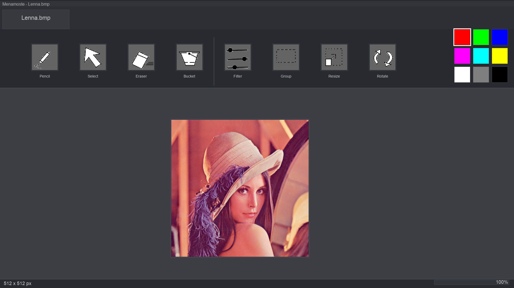

# Menamoste Image Editor

A low-level C image editor built with SDL2 featuring a dark-themed UI with real-time visual feedback for tool selection and color swatches.



## Features

- **Extended Dark Toolbar**: 330px tall toolbar with dark background (40, 42, 48)
- **Spacious Tool Layout**: 8 tool buttons with 180px spacing, centered at y=167
- **Single Visual Separator**: Clean dividing line between tool groups (Bucket | Filter)
- **Active Tool Highlighting**: Border (255, 195, 50) and icon variant swaps for selected tools
- **Wide Filename Widget**: 250px filename selector with large 22pt centered text
- **Color Swatches**: 3×3 grid of colors with white highlight on active selection
- **Canvas Border**: 2px subtle separator for visual depth
- **Tool Labels**: Descriptive text labels below each tool button (Pencil, Eraser, etc.)
- **Image Manipulation**: Draw, erase, bucket fill, filters, rotation, resizing, and selection tools
- **Cross-Platform**: Works on Windows (MinGW) and Linux

## Build

### Requirements
- GCC compiler
- SDL2 development libraries
- SDL2_ttf development libraries

### Linux
```bash
make              # Compile to bin/main
make run          # Build and run
make clean        # Clean build artifacts
```

### Windows (MinGW with Scoop)
```bash
scoop install sdl2 sdl2-ttf
mingw32-make              # Compile to bin/main
mingw32-make run          # Build and run
mingw32-make clean        # Clean build artifacts
```

The DLLs (SDL2.dll, SDL2_ttf.dll) are automatically copied to bin/ directory.

### Run
After building, run the executable:
```bash
./bin/main              # Linux
./bin/main.exe          # Windows
```

### Example
The res folder contains example images. Try with `res/Images/Lenna.bmp`.

## Structure

### Project Layout
```
Menamoste-software/
├── README.md              # This file
├── Makefile              # Build configuration (supports Linux & Windows)
│
├── src/                  # Source code (modular architecture)
│   ├── main.c            # Application orchestration
│   │
│   ├── app_init.c/h      # SDL window/renderer initialization
│   ├── app_data.c/h      # Color palette & filter matrix setup
│   ├── event_handler.c/h # Event loop processing (mouse, keyboard events)
│   │
│   ├── gui.c/h           # SDL2 rendering, toolbar, buttons, color swatches
│   ├── matrix.c/h        # Matrix/matrix_pack data structures (image representation)
│   ├── tools.c/h         # Image operations: convolution, rotation, pixel manipulation
│   ├── path.c/h          # Text input, font rendering (SDL2_ttf)
│   ├── color.c/h         # Color palette management
│   ├── filter.c/h        # Image filter implementations
│   ├── selection.c/h     # Selection and crop tools
│   ├── resize.c/h        # Image resizing
│   ├── insert.c/h        # Image insertion
│   ├── ttf.c/h           # TTF font utilities
│   ├── toolbar.c/h       # Toolbar rendering logic (extracted from gui.c)
│   ├── component.c/h     # Reusable UI component base structure
│   │
│   ├── ui_config.h       # Centralized UI constants & color definitions
│   ├── err_compat.h      # Windows/POSIX compatibility wrapper
│   └── sdl2_ttf_compat.h # SDL2_ttf header compatibility (Windows/Linux)
│
├── res/                  # Resources
│   ├── Images/           # Example BMP images (Lenna.bmp)
│   ├── Icons/            # Tool icons (normal + _select variants)
│   └── Fonts/            # TTF fonts (arial.ttf)
│
├── bin/                  # Compiled executable (created by make)
│   └── main.exe          # Windows executable
│
└── obj/                  # Object files (created by make, cleaned by make clean)
```

### Key Files

**Core Application (main.c)**
- Orchestration: SDL initialization, data setup, image loading, event loop invocation
- 155 lines (refactored from 477 lines of monolithic code)

**Initialization Modules**
- `app_init.c`: SDL window/renderer creation, error handling, cleanup
- `app_data.c`: Color palette (9 colors), filter matrices (contrast & blur), conversions
- `event_handler.c`: Complete event loop handling (mouse, keyboard, tool/color clicks)

**Data Structures (matrix.h)**
- `matrix`: 2D float array for convolution kernels and image channels
- `matrix_pack`: Triple of matrices (R, G, B channels) representing an image
- `triplet`: RGB color as floats [0.0, 1.0]

**UI Components (gui.c)**
- `draw_toolbar_bg()`: Extended 330px toolbar with dark background and vertical separator
- `draw_image_tabs()`: Large filename widget (250px wide, 73px tall) with centered text
- `draw_tool_labels()`: Text labels below tool buttons
- `draw_color_swatch()`: Color selection with white highlight on active
- `render_icon_variant()`: Tool icon rendering (normal/select variants)
- `load_icon_variants()`: Pre-load all icon textures at startup
- `draw_canvas_border()`: 2px subtle border around image canvas

**Toolbar Module (toolbar.c)**
- `toolbar_render_background()`: Toolbar with separator and divider lines
- `toolbar_render_tool_labels()`: Tool labels using TTF fonts

**Configuration (ui_config.h)**
- Centralized magic numbers: toolbar height (330), button spacing (180), font sizes
- Color constants: RGB tuples for dark theme, active tool gold, separators

**Compatibility Headers**
- `err_compat.h`: POSIX `err()` functions for Windows MinGW
- `sdl2_ttf_compat.h`: Platform-specific SDL2_ttf include paths

### Build System

The Makefile uses platform detection (`uname -s`) to handle:
- **Linux**: Standard system SDL2 libraries
- **Windows (MinGW)**: Scoop-installed SDL2/SDL2_ttf with explicit include/lib paths

## Usage Workflow

1. **Launch**: Run `./bin/main` or `./bin/main.exe`
2. **Load Image**: Enter path to BMP image (e.g., `res/Images/Lenna.bmp`)
3. **Select Tool**: Click toolbar icons to activate tools:
   - Pencil (✏️): Draw on image
   - Cursor (↖️): Selection tool
   - Eraser (🗑️): Erase pixels
   - Bucket (🪣): Fill regions
   - Filter: Apply contrast/blur
   - Group: Advanced selection
   - Resize: Resize image
   - Rotate: Rotate 90°
4. **Choose Color**: Click color swatches (9 colors available)
5. **Edit Image**: Use selected tool on image canvas
6. **Save**: Use system file operations to save edited BMP

## Architecture Notes

### Modular Design
The codebase follows a clean layered architecture:

1. **Orchestration Layer** (main.c)
   - Minimal entry point: calls init → setup → event loop → cleanup
   - Single responsibility: coordinate other modules

2. **Initialization Layer** (app_init, app_data)
   - SDL setup and teardown
   - Application data initialization (colors, filter matrices)
   - Centralized configuration values (ui_config.h)

3. **Event Processing Layer** (event_handler.c)
   - Complete event loop with all event types
   - Tool/color selection logic
   - Image manipulation dispatching

4. **Rendering Layer** (gui.c, toolbar.c)
   - UI drawing primitives
   - Theme-consistent rendering using ui_config.h
   - Reusable components (buttons, swatches, icons)

5. **Image Processing Layer** (tools.c, filter.c, etc.)
   - Matrix-based image operations
   - Convolution, rotation, resizing, selection

### Image Representation
Images are stored as `matrix_pack` (three float matrices for R, G, B channels) rather than SDL surfaces. This allows:
- Pixel-level operations using matrix algebra
- Convolution-based filters
- Normalized color values [0.0, 1.0]

### UI State Management
- `EventContext` struct: Encapsulates all event loop state (window, renderer, tool state, color state)
- `active_tool`: Tracks selected tool (-1 = none)
- `active_color_idx`: Tracks selected color (0-8)
- Icon variants (normal/select) pre-loaded at startup for instant swapping

### Platform Compatibility
Two compatibility headers solve build issues:
- `err_compat.h`: Wraps POSIX `err()` missing on Windows
- `sdl2_ttf_compat.h`: Handles SDL2_ttf header location differences

### Configuration Management
- `ui_config.h` contains all magic numbers (sizes, positions, colors)
- Single edit point for theme/layout changes
- Foundation for future theme switching
