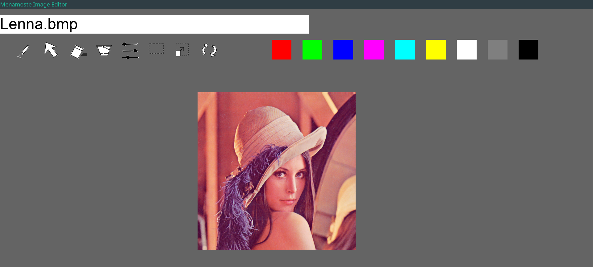

# Menamoste Image Editor
An simple, low level image editor using only the SDL2.

## Usage
## Build
Run make to compile this project to bin/main.
Furthermore, there are clean and run rules to remove temporary files and run
the program without any argument.

Note that this projet needs the SDL_ttf and SDL_image libraries to work successfully. 
They are used for text and other image types manipulation.

### Run
After having built the project, the app is located at bin/main.

### Example
The res folder contains some example images.
You should try with res/Lenna.bmp.

## Structure
+ README - What you're currently reading.

+ res - Folder for the ressources of the project. For now it's the reference
        images and icons.

+ src - Folder for the source of the project. It contains our code :
  + main.c = The all target, the program.

  + gui.c = Contains the GUI functions.
  + gui.h = Header for the gui.c with explanations of the functions.

  + matrix.c = Contains the matrix functions.
  + matrix.h = Header for the matrix.c with explanations of the functions and structures like matrix_pack or triplet.

  + tools.c = Contains all the tools for image manipulation.
  + tools.h = Header for the tools.c with explanations of the functions.

  + colors.c = Contains the colors functions.
  + colors.h = Header for the colors.c file.

+ bin - Folder that contains the executable file (can be removed by using the
        make clean command).

+ obj - Folder that contains the obj. files (can be removed by using the make
        clean command).

+ Makefile - File for GNU Make.
        Simply use the command make to compile the code.
